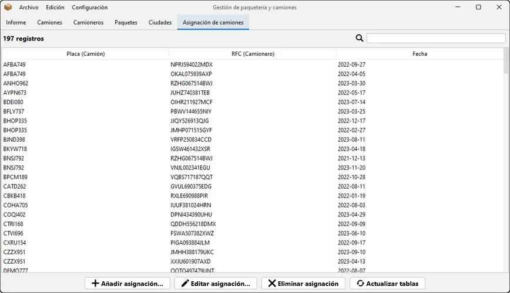
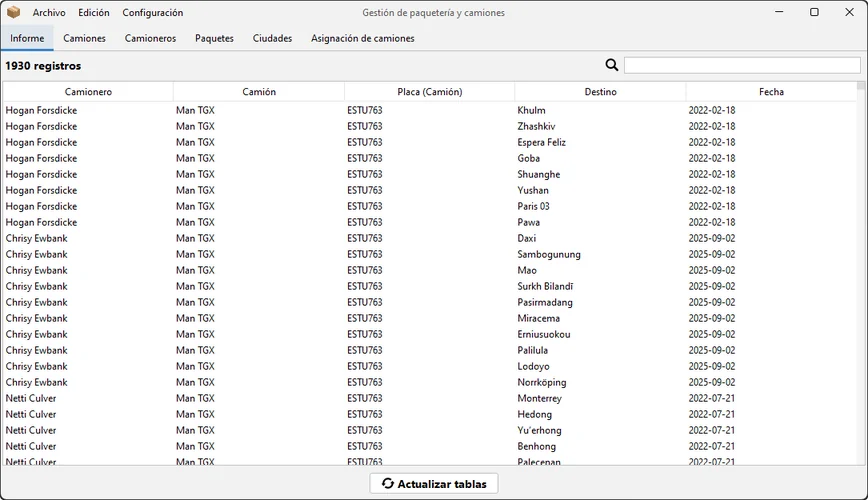
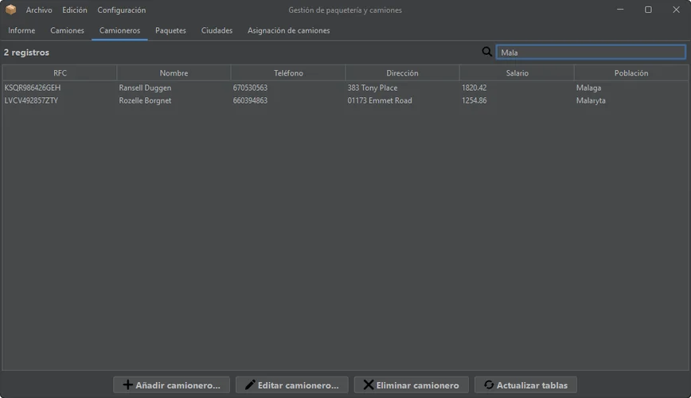
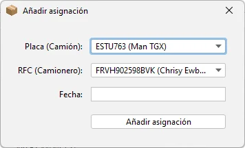
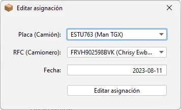
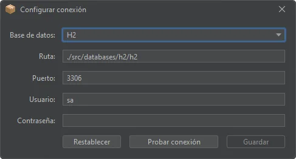

# Delivery

**Delivery** is a packages database manager where you can switch between
databases.

The project was built using **Java** and **Java Swing** and three different
local **SQL** databases (*SQLite, H2 and Derby*).

> [!NOTE]  
This application was developed during my time as a student, under a tight
deadline and while managing other projects. It offers the core functionality,
but you may encounter bugs, rough edges, and code that’s not production-ready.

# Media

  
  
  
  
  
  
  

