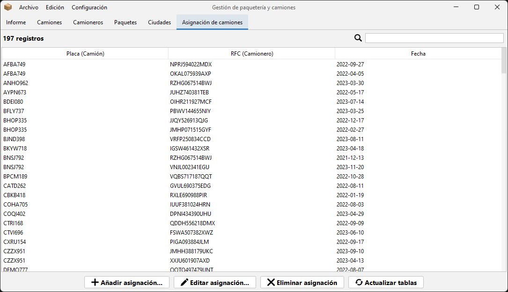
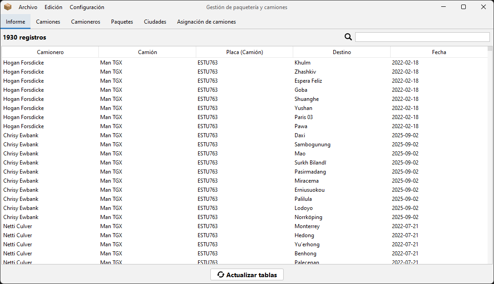
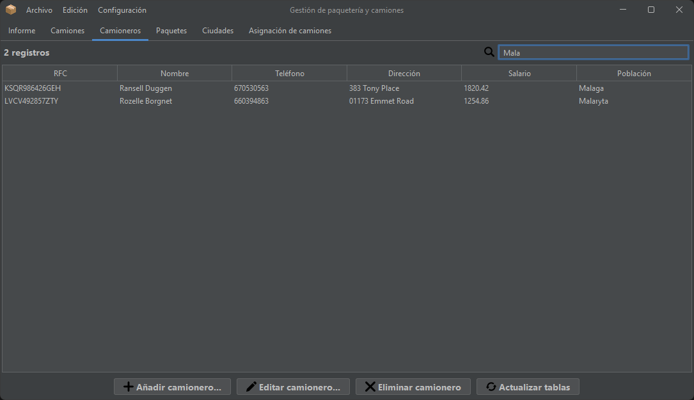
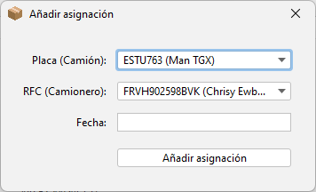
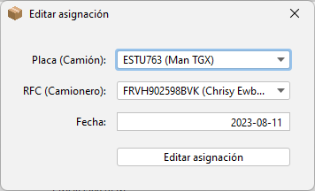
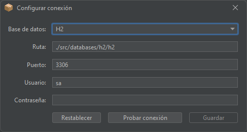

# Delivery

Delivery is a simple packages database manager where you can switch between databases.

The project was built using **Java** and **Java Swing** and three different local **SQL** databases (*SQLite, H2 and Derby*) as part of a learning exercise.

> [!NOTE]  
This app was developed during my time as a student, under a tight deadline and while managing other projects.
It offers the core functionality, but you may encounter bugs, rough edges, and code that’s not production-ready.

# Screenshots

  
  
  
  
  
  
  

